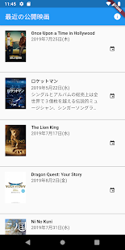

# flutter tmdb app

This is a Flutter application with TMDb API.

- get recently shown movies
- add released day at your calendar

| home (list) | detail |
|:-:|:-:|
|||

This App is released as follows.

- [‎App Store](https://apps.apple.com/jp/app/%E6%9C%80%E8%BF%91%E6%98%A0%E7%94%BB/id1467492053)
- [Google Play](https://play.google.com/store/apps/details?id=net.mituwa.recentmovies)


## Devlopment

### Api Key


You need to get Api key, then make `api_key.dart` at `lib/api/tmdb/api_key.dart`

- [My API Settings — The Movie Database (TMDB)](https://www.themoviedb.org/settings/api)


```dart
/// lib/api/tmdb/api_key.dart
class ApiConstants{
  static const String apiKey = "your_api_key";
}
```